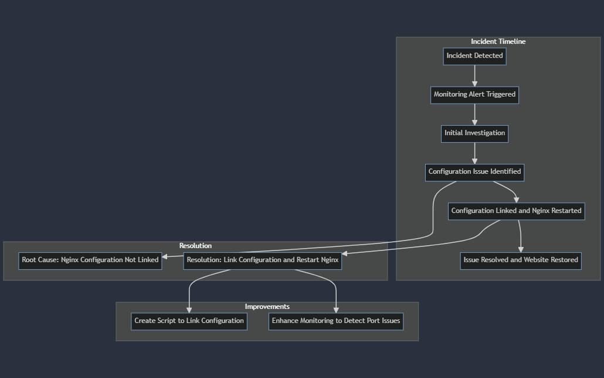

#0x19. Postmortem task using webstack debugging #1 
#By EonEmmanuel

#Issue Summary:
Duration of the Outage: The website was unavailable for a period of 1 hour, from 11:45 AM to 12:45 PM West African Time.

#Impact:
During the outage, users were unable to access the website, as the Nginx server was not listening on port 80, the standard HTTP port.

#Root Cause:
The root cause of the outage was a misconfiguration in the Nginx server settings. Specifically, the site configuration file was present in the "sites-available" directory, but it was not properly linked to the "sites-enabled" directory. As a result, the configuration was not active, and the Nginx server was not serving the website.

#Incident Timeline
11:45 AM: The issue was detected when the platform (ALX) attempted to access the website and found it unresponsive.
11:50 AM: The monitoring system at ALX triggered an alert, indicating that the site was down, and the issue was escalated.
11:55 AM: The initial investigation focused on checking the Nginx configuration files for errors, but no issues were found in the configuration itself.
12:15 PM: Further investigation revealed that the Nginx configuration in "sites-available" was not linked to "sites-enabled".
12:30 PM: The default configuration was correctly linked in "sites-enabled", and the Nginx server was restarted to apply the changes.
12:45 PM: The issue was resolved, and the website was restored to normal operation.

#Root Cause and Resolution
The root cause of the outage was the failure to link the Nginx configuration file from the "sites-available" directory to the "sites-enabled" directory, resulting in the configuration not being active and the Nginx server not listening on port 80.

#The issue was resolved by creating the necessary link and restarting the Nginx service to apply the changes.

#Corrective and Preventative Measures
To prevent similar issues in the future, the following improvements and tasks have been identified:

#Improvements:

Implement a script or automated check to ensure that after any configuration changes, the necessary configurations are properly linked and active.
Enhance the monitoring system to more effectively detect issues with the Nginx server's port configuration.

#Task List:

Create and execute a script to link the "sites-available" configuration to "sites-enabled" after each configuration change.
Implement a monitoring check to ensure that Nginx is correctly listening on port 80.

#Example Script:
Here is a sample script that can be used to ensure the Nginx configuration is properly linked and active:

[bash]
#!/usr/bin/env bash

#Ensure Nginx is properly configured and listening on port 80
#cp /etc/nginx/sites-available/default /etc/nginx/sites-enabled/default
#sudo service nginx restart
#[/bash]

#This script copies the default Nginx configuration from the "sites-available" directory to the #"sites-enabled" directory and then restarts the Nginx service to apply the changes.

#FlowChart

